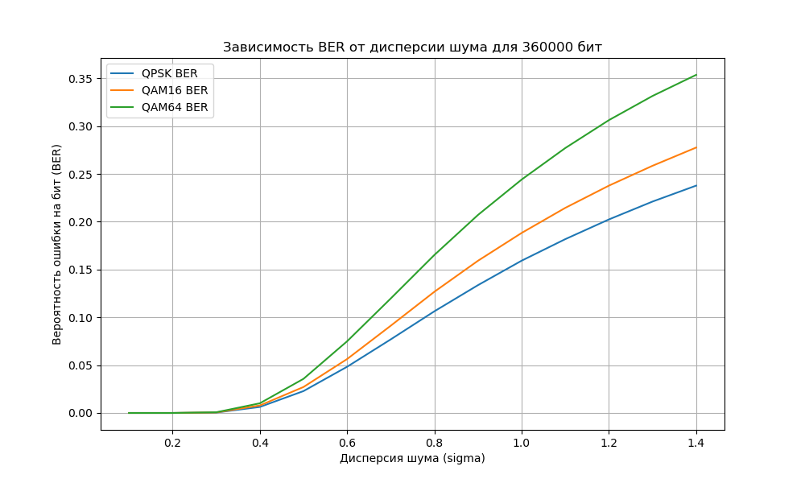

# Тестовое задание на стажировку Импульс 2024

Стандарт C++: C++20. Запуск производился на ОС Ubuntu.

[](https://skillicons.dev)
# Структура

В директории [src](src/) хранится исходный код программы. 

В директории [src/include](/src/include/) хранятся заголовочные файлы.

### Сборка

Чтобы собрать программу необходимо, находясь в корневой папке проекта, вызвать процедуру сборки:
```bash
make
```

После сборки проекта будет создана папка build, в которой хранятся объектные файлы, а так же в корневой папке создан исполняемый файл task.

Чтобы избавиться от последствий сборки, можно вызвать процедуру очистки:
```bash
make clean
```

Что удалит папку build и файлы, генерируемые на этапе сборки.
### Запуск

Для запуска программы ввести:
```bash
./task
```

После запуска программы будет создан файл result.txt, в котором хранится информация:
1. Исходная последовательность бит
2. Значение дисперсии
3. Биты после демодуляции QPSK
4. Биты после демодуляции QAM16
5. Биты после демодуляции QAM64

В файл сохраняется каждое значение дисперсии и каждая демодуляция бит для данной дисперсии. По умолчанию задана дисперсия 0.1, которая поднимается до значения 1.5 с шагом 0.1

Если передать в программу аргумент:
```bash
./task 1 
```

В консоль будет выведена вся информация о ходе работы программы:
Сначала для QPSK, затем для QAM16, затем для QAM64:
1. Значение дисперсии шума
2. Исходная последовательность бит
3. Символы после модуляции
4. Символы после наложения Гауссовского шума
5. Биты после демодуляции

> [!CAUTION]
> В данный момент в main.cpp установленным количеством бит является 36000. В консоль может быть выведено очень много информации.

Вывод работы программы:

<details>
    <summary>Вывод</summary>
    
    ...
    Dispersion: 1.2

    Bits before any modulation:
    1 1 0 0 0 0 0 1 0 1 1 0 0 1 1 0 0 1 1 1 1 0 0 0 1 0 0 0 1 0 0 1 1 0 1 1 1 1 0 1 0 0 1 1 1 1 1 1 0 1 0 1 1 1 1 1 1 0 1 1 0 0 0 0 0 1 1 1 1 0 0 1 0 0 0 1 1 0 1 1 1 1 0 0 0 1 1 0 1 1 1 0 1 1 0 1 0 1 1 1 1 1 1 1 1 1 1 0 1 0 1 0 1 1 1 0 1 0 0 0 1 1 0 0 0 0 0 0 0 1 0 1 0 1 1 0 0 0 0 0 0 0 0 1 1 1 1 0 0 1 1 1 0 1 0 0 0 0 1 0 1 1 1 1 0 0 1 0 0 0 0 0 0 1 0 1 0 1 0 0 1 1 0 1 0 0 0 0 0 1 0 1 0 0 0 0 0 0 0 1 0 1 1 0 0 1 1 0 1 1 1 0 0 1 1 1 1 1 1 1 0 0 0 0 0 0 0 0 0 1 1 0 0 1 0 0 0 0 0 1 1 1 1 0 0 1 1 1 0 0 0 1 0 0 1 0 1 0 1 1 1 0 0 1 1 0 1 0 0 1 1 0 1 1 0 1 0 1 1 0 1 1 1 0 0 1 0 1 1 1 0 0 0 0 1 1 1 0 1 1 1 1 1 0 0 1 0 0 0 1 0 0 0 0 0 0 1 0 1 0 0 0 0 0 0 1 1 1 1 1 1 0 0 0 1 0 0 1 0 0 0 0 0 0 0 0 1 1 1 0 1 1 0 1 1 1 0 0 0 1 

    QPSK mod result:
    (1,1) (-1,-1) (-1,-1) (-1,1) (-1,1) (1,-1) (-1,1) (1,-1) (-1,1) (1,1) (1,-1) (-1,-1) (1,-1) (-1,-1) (1,-1) (-1,1) (1,-1) (1,1) (1,1) (-1,1) (-1,-1) (1,1) (1,1) (1,1) (-1,1) (-1,1) (1,1) (1,1) (1,-1) (1,1) (-1,-1) (-1,-1) (-1,1) (1,1) (1,-1) (-1,1) (-1,-1) (-1,1) (1,-1) (1,1) (1,1) (-1,-1) (-1,1) (1,-1) (1,1) (1,-1) (1,1) (-1,1) (-1,1) (1,1) (1,1) (1,1) (1,1) (1,-1) (1,-1) (1,-1) (1,1) (1,-1) (1,-1) (-1,-1) (1,1) (-1,-1) (-1,-1) (-1,-1) (-1,1) (-1,1) (-1,1) (1,-1) (-1,-1) (-1,-1) (-1,-1) (-1,1) (1,1) (1,-1) (-1,1) (1,1) (-1,1) (-1,-1) (-1,-1) (1,-1) (1,1) (1,1) (-1,-1) (1,-1) (-1,-1) (-1,-1) (-1,1) (-1,1) (-1,1) (-1,-1) (1,1) (-1,1) (-1,-1) (-1,-1) (-1,1) (-1,1) (-1,-1) (-1,-1) (-1,-1) (-1,1) (-1,1) (1,-1) (-1,1) (1,-1) (1,1) (1,-1) (-1,1) (1,1) (1,1) (1,1) (-1,-1) (-1,-1) (-1,-1) (-1,-1) (-1,1) (1,-1) (-1,1) (-1,-1) (-1,-1) (-1,1) (1,1) (1,-1) (-1,1) (1,1) (-1,-1) (-1,1) (-1,-1) (1,-1) (1,-1) (1,1) (1,-1) (-1,1) (1,-1) (1,-1) (-1,1) (1,-1) (1,1) (-1,1) (-1,1) (1,-1) (1,1) (1,-1) (-1,1) (-1,1) (1,1) (-1,-1) (-1,-1) (1,1) (1,-1) (1,1) (1,1) (1,-1) (-1,1) (-1,-1) (-1,1) (-1,-1) (-1,-1) (-1,-1) (1,-1) (1,-1) (-1,-1) (-1,-1) (-1,1) (1,1) (1,1) (1,-1) (-1,-1) (1,-1) (-1,1) (-1,-1) (-1,-1) (-1,-1) (-1,-1) (1,1) (1,-1) (1,1) (-1,1) (1,1) (-1,-1) (-1,1) 
    Noisy symbols:
    (-0.304182,0.853641) (-2.29023,-0.178852) (-0.106197,-0.960077) (-1.63196,1.04033) (-0.759161,1.55504) (1.44607,1.54961) (-0.0599101,2.22516) (0.595824,-1.15341) (0.570105,0.175414) (-2.20684,-0.12301) (0.374121,-1.92729) (-0.939558,-3.41835) (0.9842,-2.07355) (-1.81535,-1.22162) (2.0299,-1.08849) (-1.89913,1.45229) (1.96708,0.682768) (1.80708,0.597721) (1.05578,2.45383) (0.381042,0.657863) (-1.1573,-2.57713) (1.08672,0.434849) (0.987709,3.00792) (0.621692,0.51327) (-2.91559,0.271648) (-0.0434334,-0.185746) (-0.590683,2.32564) (2.88348,-0.166099) (0.805715,-0.809513) (-1.39237,2.70181) (-1.01698,-0.318453) (-2.43705,-0.381279) (-0.331202,2.3401) (0.863168,-0.722867) (0.73739,0.129206) (-2.25799,0.498515) (-2.32113,-1.16182) (-1.09893,1.89533) (0.919907,-0.884982) (2.37009,1.02261) (2.59323,0.810581) (-0.459314,0.322593) (-0.92919,1.15913) (-1.22292,-0.8477) (0.728609,2.18872) (2.18909,0.116082) (1.05116,0.109717) (-1.14611,3.40573) (-4.42789,1.93098) (0.682682,2.61438) (0.505632,0.406384) (2.92372,0.303773) (1.5894,2.09816) (1.67373,-2.48946) (0.835436,-0.337544) (-0.18676,-2.11055) (2.1013,0.154839) (2.44413,-1.46006) (0.595106,-1.42889) (-1.32876,-1.53933) (1.65689,2.43731) (0.586678,-0.163003) (0.076489,-2.98626) (-2.23351,-0.91577) (-0.138108,2.98838) (-1.17772,1.18923) (-0.308091,-1.23989) (1.96046,1.96462) (-2.24859,-3.34315) (-2.2128,-3.56028) (-1.31927,-1.18629) (0.086091,2.40884) (0.400042,3.44672) (1.38907,-2.2876) (-3.55006,1.37239) (2.43975,0.814793) (-1.47437,2.88449) (-0.0229869,0.26752) (-0.515417,-0.703605) (0.736573,-0.990139) (1.27326,-0.763958) (2.05134,2.7347) (-2.70472,-1.99384) (0.62703,-1.77844) (-1.99628,-1.59526) (-3.99367,1.69597) (-1.31955,1.30492) (-0.00106534,-1.16834) (-1.58902,0.987049) (1.02308,-0.692957) (0.731233,0.778059) (-0.652867,-0.137791) (-2.89217,-1.5941) (-0.551538,-0.706276) (-1.69186,3.37817) (-2.72531,1.27905) (-2.50789,-1.31687) (-0.402334,0.0721651) (-0.0232949,-1.90568) (-0.0200013,1.90767) (-0.943923,0.856884) (-0.418469,-0.222192) (-1.75606,-0.566462) (0.633755,-1.37301) (1.17481,1.4847) (1.04519,-1.17995) (-0.939766,0.878836) (1.03945,0.105733) (1.64055,0.134732) (0.0241842,0.675141) (-3.16287,-0.0388745) (0.23918,-0.0413123) (-0.31034,-1.21853) (-1.32769,-2.89314) (-1.75082,-1.01283) (-0.791374,-0.826688) (-0.137992,1.50151) (-3.68116,-1.92067) (-0.343152,-2.24907) (0.363114,-0.961167) (1.04394,2.52112) (-0.742275,0.34592) (-0.874138,-0.822312) (0.380312,1.31129) (-2.69061,-1.86321) (-2.87672,0.785922) (-1.50848,-0.900566) (-1.40909,-0.483634) (0.894113,-0.487243) (1.22947,1.71037) (2.54198,-0.64406) (-1.32977,0.149234) (2.26552,0.439085) (-0.310341,-1.65568) (-1.58608,0.545958) (1.08348,-1.45968) (1.0901,0.85484) (-0.0883295,0.850976) (0.389468,1.42632) (1.08526,-2.49294) (3.98524,2.26167) (3.36699,-0.309435) (1.21602,1.94441) (-4.50961,1.13603) (0.392106,1.02864) (0.202872,1.57868) (0.868373,-1.09148) (3.30835,0.845906) (2.14992,-2.22042) (-1.14208,1.29701) (-0.704378,1.62788) (0.743219,-0.619659) (-0.777016,1.64157) (-1.83392,-0.552197) (-1.88357,2.46455) (-3.20019,-0.0485992) (-1.04513,0.686625) (-1.25176,-1.2594) (-1.27612,-2.44634) (1.20982,-1.61002) (-0.786576,-3.14054) (-0.575526,0.52416) (-0.210045,1.14342) (1.24643,0.799085) (1.22137,0.568088) (-0.00553549,1.1112) (-0.204496,-0.315511) (2.15355,-1.03936) (-2.17588,2.80034) (-1.97477,-1.0515) (0.696004,-2.28792) (-5.44637,-1.09448) (-1.91329,-1.19982) (-0.593929,1.3972) (2.40705,-3.16453) (1.36882,-0.293611) (0.368992,0.46123) (0.637794,3.62403) (0.390893,-1.66201) (-1.50099,-0.0736788) 
    Bits after demod:
    0 1 0 0 0 0 0 1 0 1 1 1 0 1 1 0 1 1 0 0 1 0 0 0 1 0 0 0 1 0 0 1 1 1 1 1 1 1 1 1 0 0 1 1 1 1 1 1 0 1 0 0 0 1 1 0 1 0 0 1 0 0 0 0 0 1 1 0 1 1 0 1 0 0 0 1 1 0 1 1 1 1 0 1 0 1 0 0 1 1 1 1 1 1 0 1 0 1 1 1 1 1 1 1 1 1 1 0 1 0 0 0 1 1 1 0 1 0 0 0 1 1 1 0 1 0 0 0 0 1 0 1 0 0 1 1 0 0 0 0 0 0 1 1 1 1 1 0 0 1 1 1 0 1 0 1 0 0 1 0 1 0 1 1 0 0 1 0 0 0 0 1 0 1 0 0 0 1 1 0 1 1 0 0 0 0 0 0 0 1 0 1 0 0 0 1 0 0 0 1 0 1 0 0 0 0 1 0 1 1 1 0 0 1 1 1 1 1 1 1 0 0 1 0 0 0 0 0 0 0 0 0 0 1 0 0 0 0 1 0 1 1 0 1 0 0 1 1 0 0 0 1 0 0 0 0 1 0 1 1 1 0 0 1 1 1 0 0 0 1 1 0 1 1 0 1 1 1 1 0 1 1 1 0 1 1 0 1 1 1 1 1 1 0 1 1 1 0 0 1 0 1 1 0 0 1 0 0 0 1 0 0 0 1 0 0 0 0 1 0 0 0 0 1 0 1 1 1 1 1 0 1 0 0 1 0 0 1 0 0 1 0 0 0 0 0 0 1 1 0 1 0 1 1 1 1 1 0 0 0 

    QAM16 mod result:
    (-3,3) (-1,-3) (1,-1) (1,-1) (3,-1) (-3,1) (-3,1) (-1,1) (3,1) (-1,3) (3,-3) (3,3) (-1,-1) (3,3) (3,1) (-3,-3) (3,-1) (-1,1) (-1,-3) (3,1) (-3,3) (1,-1) (1,3) (-1,3) (3,-1) (3,3) (1,3) (1,1) (1,3) (-3,1) (-3,3) (-3,-3) (-1,-1) (1,-1) (-3,-3) (-1,-3) (1,3) (3,-1) (-3,-1) (1,-3) (3,3) (1,-3) (-3,-3) (-1,-1) (-3,-1) (-1,3) (-3,-3) (-1,-1) (-3,-3) (-1,-3) (1,-1) (1,-1) (1,3) (3,-1) (3,3) (-3,-3) (-3,-3) (1,-1) (-3,-1) (-1,-3) (1,3) (3,-1) (-1,-3) (1,-3) (3,1) (-1,1) (1,1) (1,-1) (-1,3) (1,-1) (1,3) (-1,-1) (-3,3) (3,-3) (3,1) (1,3) (-3,-1) (-3,-1) (-3,-3) (1,1) (-3,-3) (3,-1) (1,3) (1,-3) (-3,-1) (-3,-3) (3,-3) (3,1) (3,-1) (-1,-3) 
    Noisy symbols:
    (-4.30418,2.85364) (-2.29023,-2.17885) (1.8938,-0.960077) (0.368035,-0.959673) (3.24084,-0.444962) (-2.55393,3.54961) (-2.05991,2.22516) (-1.40418,0.84659) (4.57011,0.175414) (-4.20684,1.87699) (2.37412,-3.92729) (3.06044,0.581654) (-1.0158,-2.07355) (2.18465,2.77838) (4.0299,0.911514) (-3.89913,-2.54771) (3.96708,0.682768) (-0.192917,0.597721) (-0.944223,-1.54617) (4.38104,0.657863) (-3.1573,1.42287) (1.08672,-1.56515) (0.987709,5.00792) (-1.37831,2.51327) (1.08441,-1.72835) (3.95657,1.81425) (-0.590683,4.32564) (2.88348,-0.166099) (0.805715,3.19049) (-5.39237,2.70181) (-3.01698,3.68155) (-4.43705,-2.38128) (-0.331202,0.340096) (0.863168,-2.72287) (-3.26261,-1.87079) (-2.25799,-3.50149) (-0.321132,2.83818) (2.90107,-0.104671) (-3.08009,-0.884982) (2.37009,-2.97739) (4.59323,2.81058) (1.54069,-1.67741) (-2.92919,-2.84087) (-3.22292,-0.8477) (-3.27139,0.188724) (0.189086,4.11608) (-2.94884,-3.89028) (-1.14611,1.40573) (-6.42789,-2.06902) (-1.31732,-1.38562) (0.505632,-1.59362) (2.92372,-1.69623) (1.5894,4.09816) (3.67373,-2.48946) (2.83544,3.66246) (-4.18676,-4.11055) (-1.8987,-3.84516) (2.44413,-1.46006) (-3.40489,-1.42889) (-1.32876,-3.53933) (1.65689,4.43731) (4.58668,-0.163003) (0.076489,-4.98626) (-0.233509,-2.91577) (3.86189,2.98838) (-1.17772,1.18923) (1.69191,-1.23989) (1.96046,1.96462) (-2.24859,0.656845) (-0.212796,-3.56028) (0.680731,2.81371) (0.086091,0.408839) (-3.59996,5.44672) (3.38907,-4.2876) (0.449943,1.37239) (2.43975,2.81479) (-3.47437,0.884487) (-2.02299,0.26752) (-2.51542,-2.7036) (0.736573,1.00986) (-2.72674,-4.76396) (4.05134,0.734697) (-0.704718,2.00616) (0.62703,-3.77844) (-3.99628,-1.59526) (-5.99367,-0.304026) (2.68045,-2.69508) (3.99893,-1.16834) (2.41098,-1.01295) (1.02308,-2.69296) 
    Bits after demod:
    1 1 1 1 0 0 0 0 0 1 1 0 0 1 1 0 0 1 1 1 1 1 0 0 1 1 0 0 1 0 0 1 1 1 0 0 1 1 1 1 0 0 1 1 1 0 1 1 0 0 0 1 1 1 1 1 1 1 0 0 0 0 0 0 1 0 1 1 1 0 0 1 0 1 0 1 1 1 0 0 1 0 0 0 0 1 1 0 0 0 1 0 1 1 0 1 0 1 1 0 1 0 1 1 0 0 0 1 0 1 1 1 1 1 1 0 1 1 1 1 1 1 0 0 1 1 1 1 1 0 0 1 0 0 1 0 0 1 0 0 0 0 0 0 1 1 0 1 0 1 1 1 0 1 0 0 0 0 1 1 1 1 0 0 0 1 1 0 0 0 0 0 0 1 0 0 1 0 0 0 0 0 1 0 0 0 0 0 1 0 0 1 1 1 1 0 0 1 0 1 0 1 1 0 0 1 1 1 0 0 1 0 0 0 1 1 1 1 1 1 1 1 1 1 0 0 0 1 0 1 1 1 0 1 0 0 0 0 0 1 0 0 1 0 0 1 0 0 1 1 1 0 0 0 0 1 1 1 1 1 1 0 0 1 0 1 1 0 1 0 1 0 1 0 0 0 0 0 0 1 1 1 1 0 1 0 1 0 0 0 0 0 1 1 1 1 1 0 1 0 1 1 1 1 1 0 0 0 1 0 0 0 0 0 0 0 1 0 1 0 1 1 0 0 1 1 0 0 1 1 0 1 0 0 1 0 0 1 0 0 1 1 1 1 0 0 1 1 0 1 1 1 0 1 1 1 0 0 1 0 

    QAM64 mod result:
    (-7,5) (5,-3) (-5,-1) (-7,7) (-3,1) (-1,-1) (1,5) (7,7) (7,-3) (-1,7) (-5,-7) (-5,7) (5,-7) (1,7) (-1,-1) (3,3) (7,-1) (5,7) (-1,3) (-7,3) (-7,5) (3,-7) (-7,-1) (-5,-7) (-5,7) (1,5) (-1,-5) (-3,5) (-5,-7) (1,-3) (1,5) (3,-7) (-7,-7) (5,-3) (-1,-1) (7,1) (1,7) (-7,-7) (-5,-1) (-5,-7) (-5,7) (-5,5) (-3,-5) (-5,7) (-5,3) (3,3) (-1,-1) (3,1) (-7,5) (-1,7) (-5,7) (1,-7) (-3,-7) (-7,1) (7,-1) (-3,1) (-7,-3) (-1,-7) (3,3) (-5,5) 
    Noisy symbols:
    (-8.30418,4.85364) (3.70977,-2.17885) (-4.1062,-0.960077) (-7.63196,7.04033) (-2.75916,1.55504) (-0.553935,1.54961) (1.94009,6.22516) (6.59582,6.84659) (8.57011,-3.82459) (-4.20684,5.87699) (-5.62588,-7.92729) (-4.93956,4.58165) (4.9842,-8.07355) (0.184655,6.77838) (0.029895,-1.08849) (2.10087,3.45229) (7.96708,0.682768) (5.80708,6.59772) (-0.944223,4.45383) (-5.61896,2.65786) (-7.1573,3.42287) (3.08672,-7.56515) (-7.01229,1.00792) (-5.37831,-7.48673) (-6.91559,6.27165) (1.95657,3.81425) (-2.59068,-3.67436) (-1.11652,3.8339) (-5.19429,-6.80951) (-1.39237,-1.29819) (0.983023,5.68155) (1.56295,-6.38128) (-6.3312,-5.6599) (4.86317,-4.72287) (-1.26261,0.129206) (5.74201,0.498515) (-0.321132,6.83818) (-7.09893,-6.10467) (-5.08009,-0.884982) (-3.62991,-6.97739) (-3.40677,6.81058) (-4.45931,6.32259) (-2.92919,-4.84087) (-7.22292,7.1523) (-5.27139,4.18872) (4.18909,4.11608) (-0.948837,-1.89028) (2.85389,3.40573) (-10.4279,5.93098) (-1.31732,8.61438) (-5.49437,6.40638) (2.92372,-7.69623) (-2.4106,-5.90184) (-6.32627,-0.489458) (6.83544,-0.337544) (-4.18676,-0.11055) (-5.8987,-3.84516) (0.444126,-7.46006) (2.59511,2.57111) (-5.32876,4.46067) 
    Bits after demod:
    1 1 1 1 1 1 0 1 0 1 0 1 0 1 1 0 0 1 1 1 1 0 0 0 1 0 0 0 1 0 1 0 0 0 1 1 1 1 1 1 0 0 1 1 1 1 1 1 0 1 1 0 0 0 1 1 0 0 0 1 0 0 0 0 0 1 1 1 0 0 0 1 1 1 1 1 1 0 1 1 1 1 0 0 0 1 1 1 0 0 1 0 1 1 0 1 1 0 0 1 1 1 1 1 1 1 1 0 1 1 0 0 1 1 1 0 1 0 0 1 1 0 1 0 0 0 0 0 0 1 0 1 1 0 0 0 0 0 0 0 0 0 0 1 1 1 1 0 0 0 1 0 1 1 0 0 0 1 0 0 1 0 1 0 1 0 1 1 0 0 0 0 0 1 0 1 1 0 1 1 1 1 0 1 0 0 0 0 0 1 0 0 0 0 1 0 0 0 0 0 1 1 1 0 1 0 0 0 1 1 1 0 0 1 1 0 1 1 1 0 1 1 0 0 0 0 0 0 0 1 1 0 0 1 0 0 0 0 1 0 1 1 1 0 1 0 1 1 1 0 0 1 0 0 1 0 1 0 1 1 1 0 0 0 1 1 0 0 0 1 1 1 0 1 1 0 0 1 1 0 1 1 1 0 1 1 0 1 1 1 1 1 1 0 0 0 0 0 1 1 1 1 1 0 0 1 0 0 0 1 0 1 0 0 1 0 1 0 0 1 1 0 0 0 0 1 1 1 1 1 0 1 1 0 0 1 0 1 0 0 0 1 0 0 0 1 0 0 1 0 1 1 0 1 1 1 0 0 0 1 

    Dispersion: 1.3

    Bits before any modulation:
    1 1 0 0 0 0 0 1 0 1 1 0 0 1 1 0 0 1 1 1 1 0 0 0 1 0 0 0 1 0 0 1 1 0 1 1 1 1 0 1 0 0 1 1 1 1 1 1 0 1 0 1 1 1 1 1 1 0 1 1 0 0 0 0 0 1 1 1 1 0 0 1 0 0 0 1 1 0 1 1 1 1 0 0 0 1 1 0 1 1 1 0 1 1 0 1 0 1 1 1 1 1 1 1 1 1 1 0 1 0 1 0 1 1 1 0 1 0 0 0 1 1 0 0 0 0 0 0 0 1 0 1 0 1 1 0 0 0 0 0 0 0 0 1 1 1 1 0 0 1 1 1 0 1 0 0 0 0 1 0 1 1 1 1 0 0 1 0 0 0 0 0 0 1 0 1 0 1 0 0 1 1 0 1 0 0 0 0 0 1 0 1 0 0 0 0 0 0 0 1 0 1 1 0 0 1 1 0 1 1 1 0 0 1 1 1 1 1 1 1 0 0 0 0 0 0 0 0 0 1 1 0 0 1 0 0 0 0 0 1 1 1 1 0 0 1 1 1 0 0 0 1 0 0 1 0 1 0 1 1 1 0 0 1 1 0 1 0 0 1 1 0 1 1 0 1 0 1 1 0 1 1 1 0 0 1 0 1 1 1 0 0 0 0 1 1 1 0 1 1 1 1 1 0 0 1 0 0 0 1 0 0 0 0 0 0 1 0 1 0 0 0 0 0 0 1 1 1 1 1 1 0 0 0 1 0 0 1 0 0 0 0 0 0 0 0 1 1 1 0 1 1 0 1 1 1 0 0 0 1 

    QPSK mod result:
    (1,1) (-1,-1) (-1,-1) (-1,1) (-1,1) (1,-1) (-1,1) (1,-1) (-1,1) (1,1) (1,-1) (-1,-1) (1,-1) (-1,-1) (1,-1) (-1,1) (1,-1) (1,1) (1,1) (-1,1) (-1,-1) (1,1) (1,1) (1,1) (-1,1) (-1,1) (1,1) (1,1) (1,-1) (1,1) (-1,-1) (-1,-1) (-1,1) (1,1) (1,-1) (-1,1) (-1,-1) (-1,1) (1,-1) (1,1) (1,1) (-1,-1) (-1,1) (1,-1) (1,1) (1,-1) (1,1) (-1,1) (-1,1) (1,1) (1,1) (1,1) (1,1) (1,-1) (1,-1) (1,-1) (1,1) (1,-1) (1,-1) (-1,-1) (1,1) (-1,-1) (-1,-1) (-1,-1) (-1,1) (-1,1) (-1,1) (1,-1) (-1,-1) (-1,-1) (-1,-1) (-1,1) (1,1) (1,-1) (-1,1) (1,1) (-1,1) (-1,-1) (-1,-1) (1,-1) (1,1) (1,1) (-1,-1) (1,-1) (-1,-1) (-1,-1) (-1,1) (-1,1) (-1,1) (-1,-1) (1,1) (-1,1) (-1,-1) (-1,-1) (-1,1) (-1,1) (-1,-1) (-1,-1) (-1,-1) (-1,1) (-1,1) (1,-1) (-1,1) (1,-1) (1,1) (1,-1) (-1,1) (1,1) (1,1) (1,1) (-1,-1) (-1,-1) (-1,-1) (-1,-1) (-1,1) (1,-1) (-1,1) (-1,-1) (-1,-1) (-1,1) (1,1) (1,-1) (-1,1) (1,1) (-1,-1) (-1,1) (-1,-1) (1,-1) (1,-1) (1,1) (1,-1) (-1,1) (1,-1) (1,-1) (-1,1) (1,-1) (1,1) (-1,1) (-1,1) (1,-1) (1,1) (1,-1) (-1,1) (-1,1) (1,1) (-1,-1) (-1,-1) (1,1) (1,-1) (1,1) (1,1) (1,-1) (-1,1) (-1,-1) (-1,1) (-1,-1) (-1,-1) (-1,-1) (1,-1) (1,-1) (-1,-1) (-1,-1) (-1,1) (1,1) (1,1) (1,-1) (-1,-1) (1,-1) (-1,1) (-1,-1) (-1,-1) (-1,-1) (-1,-1) (1,1) (1,-1) (1,1) (-1,1) (1,1) (-1,-1) (-1,1) 
    Noisy symbols:
    (-0.412863,0.841444) (-2.39775,-0.110423) (-0.0317137,-0.95675) (-1.68463,1.04369) (-0.739091,1.60129) (1.48324,1.76208) (0.0184307,2.32725) (0.562143,-1.16619) (0.700947,0.106699) (-2.47408,-0.216594) (0.321965,-2.00456) (-0.934522,-3.61987) (0.982884,-2.16301) (-1.88329,-1.24008) (2.11572,-1.09586) (-1.97405,1.48999) (2.04767,0.822999) (1.87434,0.564198) (1.06042,2.57498) (0.496129,0.629351) (-1.17041,-2.70856) (1.09395,0.387753) (0.986685,3.17525) (0.590166,0.47271) (-3.07522,0.210952) (0.0362805,-0.284558) (-0.72324,2.43611) (3.04044,-0.263274) (0.789524,-0.79364) (-1.59173,2.84362) (-1.01839,-0.261657) (-2.55681,-0.329719) (-0.275469,2.45177) (0.851765,-0.866439) (0.715506,0.223307) (-2.36283,0.456724) (-2.43123,-1.1753) (-1.10718,1.96994) (0.913233,-0.875397) (2.48426,1.0245) (2.726,0.794796) (-0.414257,0.432809) (-0.923289,1.17239) (-1.40817,-0.835008) (0.705994,2.28778) (2.28818,0.209089) (1.05543,0.0355267) (-1.15829,3.60621) (-4.71354,2.00856) (0.656239,2.74891) (0.464434,0.356916) (3.08403,0.245754) (1.63852,2.18967) (1.72987,-2.61358) (0.821723,-0.282339) (-0.285657,-2.2031) (2.19308,0.0844085) (2.56447,-1.4984) (0.561365,-1.46463) (-1.35616,-1.58427) (1.71163,2.55708) (0.718901,-0.0932538) (0.166196,-3.15178) (-2.3363,-0.908751) (-0.0662833,3.15407) (-1.19253,1.205) (-0.250432,-1.42655) (2.0405,2.21167) (-2.35264,-3.53842) (-2.31386,-3.77363) (-1.34587,-1.20181) (0.176599,2.52624) (0.350046,3.65061) (1.42149,-2.3949) (-3.76256,1.40342) (2.55973,0.799359) (-1.5139,3.04153) (0.0584309,0.373147) (-0.475035,-0.678905) (0.714621,-0.989318) (1.29603,-0.910955) (2.13895,2.87925) (-2.84678,-2.07666) (0.595949,-1.84331) (-2.07931,-1.64486) (-4.24315,1.92064) (-1.34618,1.33033) (0.0821792,-1.34904) (-1.63811,0.98597) (1.19167,-0.66737) (0.708835,0.759564) (-0.623939,-0.232607) (-3.04985,-1.64361) (-0.514166,-0.681799) (-1.74952,3.57635) (-2.86909,1.3023) (-2.63355,-1.34328) (-0.352528,0.161512) (0.0580972,-1.98116) (0.0616653,1.98331) (-0.939249,0.844957) (-0.536675,-0.157374) (-1.81906,-0.697) (0.603235,-1.40409) (1.18938,1.52509) (1.04895,-1.19495) (-0.934746,0.868739) (1.04274,0.0312112) (1.69393,0.0626262) (-0.0571338,0.64807) (-3.34311,0.0412193) (0.342444,0.0385784) (-0.252868,-1.23675) (-1.35499,-3.0509) (-1.81339,-1.18056) (-0.940655,-0.812245) (-0.0661585,1.5433) (-3.90459,-1.99739) (-0.288415,-2.35316) (0.476707,-1.1246) (1.0476,2.64788) (-0.887464,0.45808) (-0.863649,-0.974172) (0.328671,1.33723) (-2.83149,-1.93515) (-3.03311,0.768083) (-1.55086,-0.892279) (-1.60984,-0.440603) (0.885289,-0.444513) (1.2486,1.76957) (2.67047,-0.614398) (-1.35725,0.0783367) (2.37098,0.559008) (-0.419536,-1.71032) (-1.63492,0.508121) (1.09043,-1.49799) (1.0976,0.842744) (-0.0123569,0.838557) (0.505257,1.46185) (1.09237,-2.61735) (4.23401,2.36681) (3.56424,-0.251887) (1.40069,2.02311) (-4.80208,1.14737) (0.341448,1.03102) (0.303111,1.79358) (1.02407,-1.0991) (3.50071,0.833065) (2.24574,-2.32212) (-1.32059,1.32176) (-0.84641,1.68021) (0.721821,-0.587964) (-0.758434,1.69503) (-1.90341,-0.51488) (-1.9572,2.5866) (-3.38354,0.0306842) (-1.04889,0.827177) (-1.27274,-1.28102) (-1.4658,-2.56687) (1.22731,-1.66085) (-0.76879,-3.31892) (-0.540153,0.651173) (-0.144216,1.15538) (1.26697,0.782342) (1.23982,0.532095) (-0.0893301,1.28714) (-0.138204,-0.25847) (2.24968,-1.04264) (-2.27387,2.95037) (-2.056,-1.0558) (0.837338,-2.39525) (-5.8169,-1.10235) (-1.9894,-1.21647) (-0.726757,1.4303) (2.5243,-3.34491) (1.39955,-0.401412) (0.483075,0.416333) (0.60761,3.8427) (0.506801,-1.71718) (-1.54273,-0.163152) 
    Bits after demod:
    0 1 0 0 0 0 0 1 0 1 1 1 1 1 1 0 1 1 0 0 1 0 0 0 1 0 0 0 1 0 0 1 1 1 1 1 1 1 1 1 0 0 1 1 1 1 1 1 0 1 1 0 0 1 1 0 1 0 0 1 0 0 0 0 0 1 1 0 1 1 0 1 0 0 0 1 1 0 1 1 1 1 0 1 0 1 0 0 1 1 1 1 1 1 0 1 0 1 1 1 1 1 1 1 1 1 1 0 1 0 0 0 1 1 1 0 1 0 0 0 1 1 1 0 1 0 0 0 0 1 0 1 0 0 1 1 0 0 0 0 0 0 1 1 1 1 1 0 0 1 1 1 0 1 1 1 0 0 1 0 1 0 1 1 0 0 1 0 0 0 0 1 0 1 1 0 0 1 1 0 1 1 0 0 0 0 0 0 0 1 0 1 0 0 0 1 1 0 1 1 0 1 0 0 0 0 1 0 1 1 1 0 0 1 1 1 1 1 0 1 0 1 1 1 0 0 0 0 0 0 0 0 0 1 0 0 0 0 1 0 1 1 0 1 0 0 1 1 0 0 0 1 0 0 0 0 1 0 1 1 1 0 0 1 1 1 0 0 0 1 1 0 1 1 0 1 1 1 1 0 1 1 1 0 1 1 0 1 1 1 1 1 1 0 1 1 1 0 0 1 0 1 1 0 0 1 0 0 0 1 0 1 0 1 0 0 0 0 1 0 0 0 0 1 0 1 1 1 1 1 0 1 0 0 1 0 0 1 0 0 1 0 0 0 0 0 0 1 1 0 1 0 1 1 1 1 1 0 0 0 

    QAM16 mod result:
    (-3,3) (-1,-3) (1,-1) (1,-1) (3,-1) (-3,1) (-3,1) (-1,1) (3,1) (-1,3) (3,-3) (3,3) (-1,-1) (3,3) (3,1) (-3,-3) (3,-1) (-1,1) (-1,-3) (3,1) (-3,3) (1,-1) (1,3) (-1,3) (3,-1) (3,3) (1,3) (1,1) (1,3) (-3,1) (-3,3) (-3,-3) (-1,-1) (1,-1) (-3,-3) (-1,-3) (1,3) (3,-1) (-3,-1) (1,-3) (3,3) (1,-3) (-3,-3) (-1,-1) (-3,-1) (-1,3) (-3,-3) (-1,-1) (-3,-3) (-1,-3) (1,-1) (1,-1) (1,3) (3,-1) (3,3) (-3,-3) (-3,-3) (1,-1) (-3,-1) (-1,-3) (1,3) (3,-1) (-1,-3) (1,-3) (3,1) (-1,1) (1,1) (1,-1) (-1,3) (1,-1) (1,3) (-1,-1) (-3,3) (3,-3) (3,1) (1,3) (-3,-1) (-3,-1) (-3,-3) (1,1) (-3,-3) (3,-1) (1,3) (1,-3) (-3,-1) (-3,-3) (3,-3) (3,1) (3,-1) (-1,-3) 
    Noisy symbols:
    (-4.41286,2.84144) (-2.39775,-2.11042) (1.96829,-0.95675) (0.315372,-0.956312) (3.26091,-0.398708) (-2.51676,3.76208) (-1.98157,2.32725) (-1.43786,0.833806) (4.70095,0.106699) (-4.47408,1.78341) (2.32196,-4.00456) (3.06548,0.380125) (-1.01712,-2.16301) (2.11671,2.75992) (4.11572,0.90414) (-3.97405,-2.51001) (4.04767,0.822999) (-0.12566,0.564198) (-0.939575,-1.42502) (4.49613,0.629351) (-3.17041,1.29144) (1.09395,-1.61225) (0.986685,5.17525) (-1.40983,2.47271) (0.924776,-1.78905) (4.03628,1.71544) (-0.72324,4.43611) (3.04044,-0.263274) (0.789524,3.20636) (-5.59173,2.84362) (-3.01839,3.73834) (-4.55681,-2.32972) (-0.275469,0.451771) (0.851765,-2.86644) (-3.28449,-1.77669) (-2.36283,-3.54328) (-0.431227,2.8247) (2.89282,-0.0300602) (-3.08677,-0.875397) (2.48426,-2.9755) (4.726,2.7948) (1.58574,-1.56719) (-2.92329,-2.82761) (-3.40817,-0.835008) (-3.29401,0.287784) (0.288177,4.20909) (-2.94457,-3.96447) (-1.15829,1.60621) (-6.71354,-1.99144) (-1.34376,-1.25109) (0.464434,-1.64308) (3.08403,-1.75425) (1.63852,4.18967) (3.72987,-2.61358) (2.82172,3.71766) (-4.28566,-4.2031) (-1.80692,-3.91559) (2.56447,-1.4984) (-3.43864,-1.46463) (-1.35616,-3.58427) (1.71163,4.55708) (4.7189,-0.0932538) (0.166196,-5.15178) (-0.336301,-2.90875) (3.93372,3.15407) (-1.19253,1.205) (1.74957,-1.42655) (2.0405,2.21167) (-2.35264,0.461583) (-0.313862,-3.77363) (0.654125,2.79819) (0.176599,0.526242) (-3.64995,5.65061) (3.42149,-4.3949) (0.237438,1.40342) (2.55973,2.79936) (-3.5139,1.04153) (-1.94157,0.373147) (-2.47503,-2.67891) (0.714621,1.01068) (-2.70397,-4.91095) (4.13895,0.879255) (-0.846777,1.92334) (0.595949,-3.84331) (-4.07931,-1.64486) (-6.24315,-0.0793613) (2.65382,-2.66967) (4.08218,-1.34904) (2.36189,-1.01403) (1.19167,-2.66737) 
    Bits after demod:
    1 1 1 1 0 0 0 0 0 1 1 0 0 1 1 0 0 1 1 1 1 1 0 0 1 1 0 1 1 0 0 1 1 1 0 0 1 1 1 1 1 1 1 1 1 0 1 1 0 0 0 1 1 1 1 1 1 1 0 0 0 0 0 0 1 1 0 0 1 0 0 1 0 1 0 1 1 1 0 0 1 0 0 0 0 1 1 0 0 0 1 0 1 1 0 1 0 1 1 0 1 1 0 0 0 0 0 1 0 1 1 1 1 1 1 0 1 1 1 1 1 1 0 0 1 1 1 1 1 0 0 1 0 0 1 0 0 1 0 0 0 0 0 0 1 1 0 1 0 1 1 1 0 1 0 0 0 0 1 1 1 1 0 0 0 1 1 0 0 0 0 0 0 1 0 0 1 0 0 0 0 0 1 0 0 0 0 0 1 0 0 1 1 1 1 0 0 1 0 1 0 1 1 0 0 1 1 1 0 0 1 0 0 0 1 1 1 1 1 1 1 1 1 1 0 0 0 1 0 1 1 1 0 1 0 0 0 0 0 1 0 0 1 0 0 1 0 0 1 1 1 0 0 0 0 1 1 1 1 1 1 0 0 1 0 1 1 0 1 1 1 1 1 0 0 0 0 0 0 1 1 1 1 0 1 0 1 0 0 0 0 0 1 1 1 1 1 0 1 0 1 1 1 1 1 0 0 0 1 0 0 1 0 0 0 0 1 0 1 0 1 1 0 0 1 1 0 0 1 0 0 1 0 0 1 0 1 1 1 1 1 1 1 0 0 0 1 1 0 1 0 0 0 1 1 1 0 0 1 0 

    QAM64 mod result:
    (-7,5) (5,-3) (-5,-1) (-7,7) (-3,1) (-1,-1) (1,5) (7,7) (7,-3) (-1,7) (-5,-7) (-5,7) (5,-7) (1,7) (-1,-1) (3,3) (7,-1) (5,7) (-1,3) (-7,3) (-7,5) (3,-7) (-7,-1) (-5,-7) (-5,7) (1,5) (-1,-5) (-3,5) (-5,-7) (1,-3) (1,5) (3,-7) (-7,-7) (5,-3) (-1,-1) (7,1) (1,7) (-7,-7) (-5,-1) (-5,-7) (-5,7) (-5,5) (-3,-5) (-5,7) (-5,3) (3,3) (-1,-1) (3,1) (-7,5) (-1,7) (-5,7) (1,-7) (-3,-7) (-7,1) (7,-1) (-3,1) (-7,-3) (-1,-7) (3,3) (-5,5) 
    Noisy symbols:
    (-8.41286,4.84144) (3.60225,-2.11042) (-4.03171,-0.95675) (-7.68463,7.04369) (-2.73909,1.60129) (-0.516762,1.76208) (2.01843,6.32725) (6.56214,6.83381) (8.70095,-3.8933) (-4.47408,5.78341) (-5.67804,-8.00456) (-4.93452,4.38013) (4.98288,-8.16301) (0.116709,6.75992) (0.11572,-1.09586) (2.02595,3.48999) (8.04767,0.822999) (5.87434,6.5642) (-0.939575,4.57498) (-5.50387,2.62935) (-7.17041,3.29144) (3.09395,-7.61225) (-7.01332,1.17525) (-5.40983,-7.52729) (-7.07522,6.21095) (2.03628,3.71544) (-2.72324,-3.56389) (-0.959559,3.73673) (-5.21048,-6.79364) (-1.59173,-1.15638) (0.981609,5.73834) (1.44319,-6.32972) (-6.27547,-5.54823) (4.85177,-4.86644) (-1.28449,0.223307) (5.63717,0.456724) (-0.431227,6.8247) (-7.10718,-6.03006) (-5.08677,-0.875397) (-3.51574,-6.9755) (-3.274,6.7948) (-4.41426,6.43281) (-2.92329,-4.82761) (-7.40817,7.16499) (-5.29401,4.28778) (4.28818,4.20909) (-0.944574,-1.96447) (2.84171,3.60621) (-10.7135,6.00856) (-1.34376,8.74891) (-5.53557,6.35692) (3.08403,-7.75425) (-2.36148,-5.81033) (-6.27013,-0.613579) (6.82172,-0.282339) (-4.28566,-0.203096) (-5.80692,-3.91559) (0.56447,-7.4984) (2.56136,2.53537) (-5.35616,4.41573) 
    Bits after demod:
    1 1 1 1 1 1 0 1 0 1 0 1 0 1 1 0 0 1 1 1 1 0 0 0 1 0 0 0 1 0 1 0 0 0 1 1 1 1 1 1 0 1 1 1 1 1 1 1 0 1 1 0 0 0 1 1 0 0 0 1 1 1 1 0 0 1 1 1 0 0 0 1 1 1 1 1 1 0 1 1 1 1 0 0 0 1 1 1 0 0 1 0 1 1 0 1 1 0 1 0 0 0 1 1 1 1 1 0 1 1 0 0 1 1 1 0 1 0 0 1 1 0 1 0 0 0 0 0 0 1 0 1 1 0 0 0 0 0 0 0 0 0 0 1 1 1 1 0 0 0 1 0 1 1 0 1 0 1 0 0 1 0 1 0 1 0 1 1 0 0 0 0 0 1 0 1 1 0 1 1 1 1 0 1 0 0 0 0 0 1 0 0 0 0 1 0 0 0 0 0 1 1 1 0 1 0 0 0 1 1 1 0 0 1 1 0 1 1 1 0 1 1 0 0 0 0 0 0 0 1 1 0 0 1 0 0 0 0 1 0 1 1 1 0 1 0 1 1 1 0 0 1 0 0 1 0 1 0 1 1 1 0 0 0 1 1 0 0 0 1 1 1 0 1 1 0 0 1 1 0 1 1 1 0 1 1 0 1 1 1 1 1 1 0 0 0 0 0 1 1 1 1 1 0 0 1 0 0 0 1 0 1 0 0 1 0 1 0 0 1 1 0 0 0 0 1 1 1 1 1 0 1 1 0 0 1 0 1 0 0 0 1 0 0 0 1 0 0 1 0 1 1 0 1 1 1 0 0 0 1 

</details>

### Графики
График строился при помощи [скрипта на Python](BER.py)
Скрипт считывает информацию, хранящуюся в файле result.txt, который генерируется после работы программы с модулятором и демодулятором.
Скрипт рассчитывает вероятность ошибки на бит при заданном уровне дисперсии для каждого вида модуляции, и выводит полученные значения на график.

